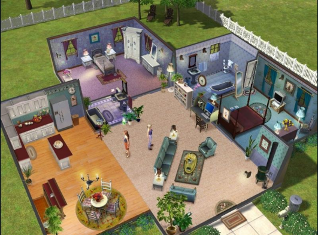
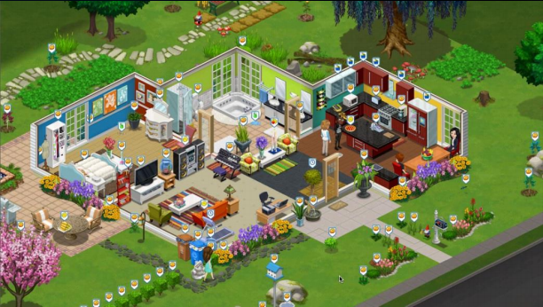

<!-- configuracion de colores es opcional pero ultil-->
<section id="themes">
	<h2>Themes setting</h2>
	

		Themes:  
		<a href="?#/themes">Default</a> -
		<a href="?theme=sky#/themes">Sky</a> -
		<a href="?theme=beige#/themes">Beige</a> -
		<a href="?theme=simple#/themes">Simple</a> -
		<a href="?theme=serif#/themes">Serif</a> -
		<a href="?theme=night#/themes">Night</a>  
		<a href="?theme=moon#/themes">Moon</a> -
		<a href="?theme=solarized#/themes">Solarized</a>
	

</section>

Slide:

# Comunicación desde los Video Juegos

Profesor:

Ing. John Higuera

Slide:

###VIDEOJUEGOS COMO MEDIO DE COMUNICACIÓN (I)

* “Medio de entretenimiento” es anticuado decirlo,<!-- .element: class="fragment" data-fragment-index="1"-->

* Análogo al cine, a la televisión y al radio, comercial.<!-- .element: class="fragment" data-fragment-index="2"-->

* En el boom de la industria, esta era tuvo una fuerte
tendencia para niños, algo que ha cambiado con las
generaciones actualmente, <!-- .element: class="fragment" data-fragment-index="3"-->

* Cambio en Forma y Contenido por muchos factores, como
medios tradicionales y nuevos medios.<!-- .element: class="fragment" data-fragment-index="4"-->

* Entablando un diálogo entre estos medios desde
contenidos, formas de narración y técnicas de
marketing, esto se explica con la teoría Remediation,<!-- .element: class="fragment" data-fragment-index="5"-->

Slide:

###VIDEOJUEGOS COMO MEDIO DE COMUNICACIÓN (II)

* Industria cultural, refleja las necesidades, ilusiones,
fantasías, gustos, intelecto, capacidad de narración, entre
otras, de la sociedad de principio del SXXI.<!-- .element: class="fragment" data-fragment-index="1"-->

* El videojuego, como todo objeto cultural, no solamente es
producto de la cultura y sociedad sino también el mismo
hecho de existir la cambia y puede llegar a transformarla.<!-- .element: class="fragment" data-fragment-index="2"-->

* Sociedad y cultura en línea.<!-- .element: class="fragment" data-fragment-index="3"-->

* Capacidad educativa con alto retorno.<!-- .element: class="fragment" data-fragment-index="4"-->

* Su papel en los medios de comunicación apenas esta
iniciando.<!-- .element: class="fragment" data-fragment-index="5"-->

Slide:

###VIDEOJUEGOS COMO MEDIO DE COMUNICACIÓN (III)

* Transmitirle a los niños los valores culturales.<!-- .element: class="fragment" data-fragment-index="1"-->

* Simuladores, virtualización de situaciones y escenarios.<!-- .element: class="fragment" data-fragment-index="2"-->

* Como medio masivo para proponer una idea, para
rechazarla, para protestar, para dar cierta información a la
gente.<!-- .element: class="fragment" data-fragment-index="3"-->

* Es una persona, una mente, que está detrás de todo contenido
mediático. Y aún así por más que el autor de un medio trate de
ser lo más objetivo posible, salirse de la escena, narrar o
presentar sin prejuicios, no será posible ya que el mismo autor
está moldeado por una cultura y un contexto del cual es
imposible escapar, a la vez que tiene que hacer decisiones de
elección y formato de la información presentada.<!-- .element: class="fragment" data-fragment-index="4"-->

Slide:

###VIDEOJUEGOS COMO MEDIO DE COMUNICACIÓN (IV)

* Gonzalo Frasca, identifica más niveles en donde un autor
puede expresar su manera de entender la realidad y
presentarla como él guste:<!-- .element: class="fragment" data-fragment-index="1"-->

- El nivel de la reglas.<!-- .element: class="fragment" data-fragment-index="2"-->

- La libertad que tiene el jugador de actuar dentro del juego,<!-- .element: class="fragment" data-fragment-index="3"-->

- El nivel de las metas (cuál es el objetivo del juego)<!-- .element: class="fragment" data-fragment-index="4"-->

- El nivel de las meta-reglas (que tanta flexibilidad hay en las
reglas del juego).<!-- .element: class="fragment" data-fragment-index="5"-->

Slide:

###VISION DE NARRATIVA EN LOS JUEGOS

* Después de todo los jugadores no perciben de los juegos
más que sucesiones de hechos, que podrían moldearse de
acuerdo a las reglas del drama o la poética para un efecto
mayor.<!-- .element: class="fragment" data-fragment-index="1"-->

* Único hilo<!-- .element: class="fragment" data-fragment-index="2"-->

* Multiples Decisiones, un único resultado.<!-- .element: class="fragment" data-fragment-index="3"-->

* Multiples desenlaces y consecuencias.<!-- .element: class="fragment" data-fragment-index="4"-->

Slide:

###VISION LUDOLOGISTA

* Los juegos son generadores de sesiones de juego, y que si
éstas son en su esencia narrativa.<!-- .element: class="fragment" data-fragment-index="1"-->

* Desde la perspectiva ludologista, es posible que la
interacción con un juego genere narrativa, e incluso puede
que un juego incluya narrativa, de manera impuesta por su
desarrollador.<!-- .element: class="fragment" data-fragment-index="2"-->

* Conjunto de las sesiones de juego que puede generar un
árbol de muestreo.<!-- .element: class="fragment" data-fragment-index="3"-->

Slide:

###MENSAJE DEL AUTOR

* Capacidad tradicional de transmitir.<!-- .element: class="fragment" data-fragment-index="1"-->

* Capacidades únicas frente a otros medios.<!-- .element: class="fragment" data-fragment-index="2"-->

* Combinación de estructura, reglas, audios, mecánicas,
contextos, historia, personajes, look and feel, imágenes
interfaz, dispositivos, ect.<!-- .element: class="fragment" data-fragment-index="3"-->

Slide:

###CASO LOS SIMS (I)

* Los medios masivos para crítica y expresión social,
económica, política, y de cualquier tema relevante para la
sociedad.<!-- .element: class="fragment" data-fragment-index="1"-->

* El hecho de que el videojuego tenga que ser "jugado" y el
usuario debe de participar en él, el mensaje es más directo
ya que el jugador es quién lo está jugando<!-- .element: class="fragment" data-fragment-index="2"-->

<!-- .element: class="fragment" data-fragment-index="2"-->

Slide:

###CASO LOS SIMS (II)

* Mensaje puramente comunista o capitalista.<!-- .element: class="fragment" data-fragment-index="1"-->

* La felicidad de los habitantes de este juego depende en
gran medida de su economía y de los productos <!-- .element: class="fragment" data-fragment-index="2"-->

 <!-- .element: class="fragment" data-fragment-index="2"-->  <!-- .element: class="fragment" data-fragment-index="2"-->

